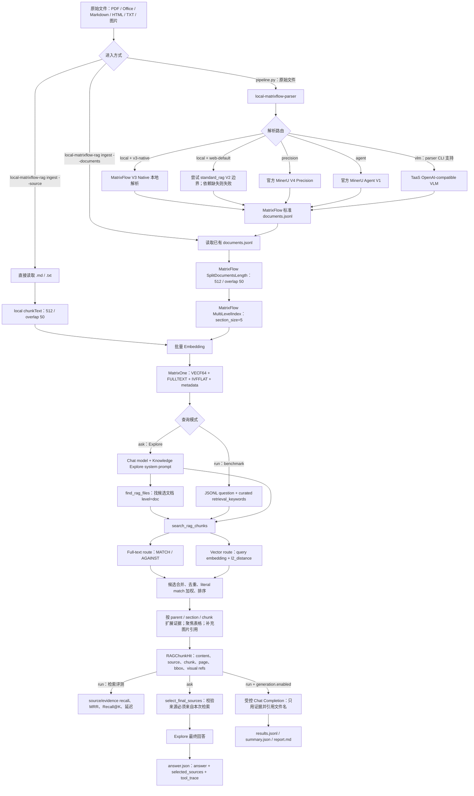

# 当前本地 MOI / MatrixFlow RAG Pipeline

> 日期：2026-08-05
> 范围：说明当前 `moi-benchmark/rag` 本地实现如何把原始文件变成可检索知识，再完成检索、回答和评测。
> 重要边界：本文描述的是本地 benchmark/prototype 对 MatrixFlow 产品代码的组合方式，不把它误称为完整部署的 MOI Web 应用或线上 `standard_rag` 全链路。

## 1. 一句话结论

当前本地 RAG 是一条“两阶段、两种查询模式”的流水线：

```text
Stage 1：原始文件 → MatrixFlow 标准 documents.jsonl
Stage 2：documents.jsonl → 分块/多级索引 → Embedding → MatrixOne
         → Full-text + Vector 检索 → 证据扩展 → 回答/评测
```

查询阶段有两个分支：

1. **可控 benchmark 分支（`run`）**：直接使用数据集里的 `retrieval_keywords` 调用产品 `SearchRAGChunks`，隔离检索质量；可选再调用一次受控 Chat Completion 做回答。
2. **Explore 问答分支（`ask`）**：加载 MatrixFlow 的 Knowledge Explore system prompt，让模型通过 `find_rag_files`、`search_rag_chunks`、`select_final_sources` 工具循环完成来源发现、证据检索、来源选择和最终回答。

本地实现复用了产品核心检索和解析代码，但没有启动 `moi-frontend`、`moi-backend`、Catalog、Mowl 服务、Agent Runtime 或 A2A/Web transport。因此它更接近“产品核心逻辑的本地可复现实验入口”。

## 2. 总体流程图



## 3. Stage 1：文档解析与标准化

### 3.1 入口和输出

原始文件通过 [`local-matrixflow-parser`](../../prototypes/local-matrixflow-parser/README.md) 的 `ParseFile` 进入解析阶段。CLI 入口在 [`cmd/local-matrixflow-parser/main.go`](../../prototypes/local-matrixflow-parser/cmd/local-matrixflow-parser/main.go:53)。

每个文件会生成一个独立的 timestamped run 目录，主要产物是：

```text
parse-run/
├── result.json          # 完整解析结果、引擎、路由、依赖和耗时
├── documents.jsonl      # 后续 RAG ingestion 的稳定边界
├── plain-text.txt       # 如果解析结果有纯文本
├── summary.json         # block 类型、字符数、backend、parser version
└── product-artifacts/   # 解析器中间产物/布局/图片等
```

`documents.jsonl` 的基本边界是 MatrixFlow 标准 document：

```json
{
  "id": "...",
  "content": "...",
  "type": "text",
  "metadata": {
    "file_id": "...",
    "file_name": "...",
    "source_path": "...",
    "document_index": 0
  }
}
```

解析器会为每个 block 补充稳定的本地 `file_id`、文件名、源路径和 block 序号。这样后面的 gold 只需要引用文件身份，不需要绑定某次运行生成的 chunk ID。

### 3.2 当前解析路由

| CLI 路由 | 实际路径 | 适用场景 | 当前边界 |
|---|---|---|---|
| `--pipeline local --profile v3-native` | MatrixFlow V3 Native | 本地 TXT、Markdown、HTML、文本层 PDF；Office 可接 OpenXML | 明确是 local-only，不等同于 Web `standard_rag` V2 |
| `--pipeline local --profile web-default` | 尝试遵循 `standard_rag` V2 parser boundary | 需要验证 Web-equivalent 解析依赖时 | PDF/Office 等依赖未配置会显式失败，不静默替换解析器 |
| `--pipeline precision` | 官方 MinerU V4 `/api/v4/file-urls/batch` | 扫描 PDF、复杂版式 PDF | 需要 `MINERU_API_TOKEN`；结果再归一化为 MatrixFlow blocks |
| `--pipeline agent` | 官方 MinerU Agent V1 | 轻量 PDF 解析 | 无 token，但有文件/page 限制，主要返回 Markdown |
| `--pipeline vlm` | TaaS OpenAI-compatible VLM | 图片 OCR、caption、视觉文档补充 | 当前 parser CLI 支持；外层 `pipeline.py` 的 parser 选项未把它列为默认编排路由 |

解析器的产品边界和依赖由 [`parser.go`](../../prototypes/local-matrixflow-parser/parser.go:103) 与 [`plan.go`](../../prototypes/local-matrixflow-parser/plan.go:10) 决定。对于 PDF、Office、图片和音视频，系统会显式记录 MinerU、OpenXML、soffice、VLM、ASR 等依赖状态。

## 4. Stage 2：入库、分块和索引

### 4.1 两种 ingestion 路径

当前本地代码有两种入库方式，不能混为一谈。

#### A. 产品 documents 路径：`--documents`

这是端到端 pipeline 处理原始文件时使用的路径：

```text
documents.jsonl
  → readParsedDocuments
  → MatrixFlow SplitDocumentsLength
  → MatrixFlow MultiLevelIndex
  → metadata 归一化和稳定 chunk ID
  → embedding
  → MatrixOne
```

实现位于 [`product_ingest.go`](../../prototypes/local-matrixflow-rag/product_ingest.go:26)。它会：

1. 读取解析器生成的每行 document。
2. 调用 MatrixFlow `SplitDocumentsLength`，默认 `chunk_size=512`、`overlap=50`。
3. 调用 MatrixFlow `MultiLevelIndex`，默认 `section_size=5`，生成 `doc / section / chunk` 多级索引关系。
4. 跳过空的 image-only block；这些 block 仍保留在 parser artifact，但不会进入纯文本 embedding 表。
5. 统一 `file_id`、`file_name`、`level`、`doc_id`、`section_id`、`chunk_index`、`index_version`、`chunk_id` 等字段。
6. 按 embedding batch 生成向量，然后写入 MatrixOne。

#### B. 简单目录路径：`--source`

如果直接给 `local-matrixflow-rag ingest --source`，当前实现只读取目录下的 `.md` 和 `.txt` 文件，然后由本地 [`chunkText`](../../prototypes/local-matrixflow-rag/main.go:653) 做固定字符窗口分块，再 embedding 和写库。

这条路径**不经过** `SplitDocumentsLength` 和 `MultiLevelIndex`。因此：

- 用来做简单 Markdown/text smoke test 很方便；
- 要测试产品 parser 输出的真实 ingestion 行为，应使用 `--documents parser-run/documents.jsonl`，或直接使用 [`pipeline.py`](../../prototypes/local-matrixflow-pipeline/pipeline.py:86)。

### 4.2 Embedding

配置在 [`config.example.json`](../../prototypes/local-matrixflow-rag/config.example.json) 中：

| 模式 | 当前用途 | 说明 |
|---|---|---|
| `taas` | 产品模型评测 | 默认 `bge-m3`，示例维度 1024，通过 OpenAI-compatible `/embeddings` 调用 TaaS |
| `openai` | 兼容外部 embedding 服务 | 使用配置中的 `base_url`、model 和 API key 环境变量 |
| `hash` | 离线 wiring smoke test | 默认 256 维的确定性哈希向量，能验证链路，但质量结果不代表产品 embedding |

入库和查询必须使用兼容的 embedding 模型/维度。改变模型或维度后，应使用 `--force` 重建当前 benchmark vector table。

### 4.3 MatrixOne 表

本地 benchmark 会创建一个产品兼容的向量表，核心字段包括：

```text
id              稳定 chunk ID
embedding       VECF64(dimension)
content         chunk 文本
meta            JSON metadata
file_id         源文件 ID
page_number     页码（如果有）
level           doc / section / chunk
doc_id          文档级 ID
section_id      section ID
chunk_index     chunk 顺序
index_version   当前索引版本
disabled        是否禁用
```

表同时建立：

- `FULLTEXT` 内容索引，供 full-text route 使用；
- `IVFFLAT` embedding 索引，供向量检索使用；
- `file_id`、`level`、`chunk_index` 等普通索引，供范围过滤和证据扩展使用。

写入逻辑位于 [`openBenchmarkDB`](../../prototypes/local-matrixflow-rag/main.go:845) 和 [`writeChunks`](../../prototypes/local-matrixflow-rag/main.go:941)。每次写入会删除本次文件对应的旧 rows；如果 corpus 删除了旧文件，应使用 `--force`，避免表里残留已删除文件。

## 5. 查询阶段：SearchRAGChunks 实际做什么

核心实现是 MatrixFlow checkout 中的 [`rag_retrieval.go`](../../../../matrixflow/moi-core/agent-tools/knowledge/service/rag_retrieval.go:168)，本地 benchmark 通过 `NewSearchRAGChunks` 直接调用它。

### 5.1 查询 scope

每次请求都带一个 `WorkspaceScope`，至少包含：

```text
workspace_id
database name
vector table
embedding model
```

还可以带 `RAGSources`、semantic model、volume ID 和 file ID 过滤。服务会根据 scope 拆出实际查询源，过滤 disabled rows，并尽量使用当前 `index_version`。

### 5.2 Explore 模式下的文件发现

`find_rag_files` 只看 `level='doc'` 的行，按文件名、公司、年份、报告类型和 query 做候选文件发现。它的作用是先缩小知识范围，不是最终证据检索。

### 5.3 两条检索 route

`search_rag_chunks` 对同一组关键词同时执行两条 route：

1. **Full-text route**：对 `content` 执行 MatrixOne `MATCH(content) AGAINST(... IN NATURAL LANGUAGE MODE)`。
2. **Vector route**：先对每个 keyword 生成 query embedding，再基于 `l2_distance(embedding, query_vector)` 取候选 chunk。

两条 route 都支持 `file_ids`、`volume_id`、当前索引版本和 `max_hits` 等过滤条件。

### 5.4 候选合并、排序和扩展

候选结果合并时会：

- 按 chunk identity 去重；
- 记录命中的 route：`fulltext` 或 `vector_l2`；
- 将 literal match、route rank 和命中情况纳入排序；
- 为候选分配 `RetrievalAnchorRank`；
- 根据 `parent_index`、`chunk_index`、section 和 `before/after` 参数扩展上下文；
- 对长表格做聚焦，避免只返回一个无法解释的表格片段；
- 根据 block UUID 补充嵌入图片引用；如果直接没有图片引用，还会检查相邻 parent 的图片 block；
- 返回 source、page、bbox、object、image/page-image 等可追踪字段。

所以当前检索并不是“只取 top-k 向量结果”，而是：

```text
full-text candidates
       + vector candidates
       → merge/dedup/rank
       → parent/section/context expansion
       → table focus
       → visual reference enrichment
       → RAGChunkHit
```

当前本地 `explore.go` 暴露的模型工具是 `find_rag_files`、`search_rag_chunks` 和 `select_final_sources`。虽然 `SearchRAGChunks` 会给返回 chunk 补充视觉引用，但本地 Explore adapter 没有另外暴露 `search_visual_image` 工具，因此当前流程不是完整的视觉检索 Agent 流程。

## 6. 两种回答模式

### 6.1 `run`：可控 benchmark 的 retrieve-then-generate

`run` 的主循环在 [`runDataset`](../../prototypes/local-matrixflow-rag/main.go:1072)：

```text
读取 question JSONL
  → 使用 retrieval_keywords；没有则使用完整 question
  → SearchRAGChunks
  → 记录 chunks、routes、score、latency
  → 计算检索指标
  → 如果 generation.enabled=true，再调用一次 Chat Completion
```

这种模式的目的，是把 Agent 的 query planning 与检索器质量分开。它不测模型会不会自己拆 query、先找文件或决定何时停止。

受控生成使用的 system prompt 是：

```text
Answer only from the supplied evidence.
If the evidence is insufficient, say so.
Cite source filenames in square brackets.
```

它会把每个 chunk 以 `[source=... chunk=...]` 形式放进 evidence，然后调用 OpenAI-compatible `/chat/completions`。这条路径不是完整 Explore Agent，只是固定的检索后生成对照。

### 6.2 `ask`：Explore-compatible 知识问答

`ask` 的实现位于 [`explore.go`](../../prototypes/local-matrixflow-rag/explore.go:50)，主要流程是：

```text
用户问题
  → 加载 checked-out Knowledge Explore system prompt
  → Chat Completion，允许工具调用
  → find_rag_files
  → search_rag_chunks
  → select_final_sources
  → 最终自然语言回答
```

模型最多循环 10 个 tool turns。代码会维护：

- `retrievalCompleted`：是否成功执行过 `search_rag_chunks`；
- `allowedChunkIDs`：本次检索实际返回的 chunk ID 集合；
- `sourcesSelected`：是否成功调用过 `select_final_sources`。

`select_final_sources` 会拒绝不属于本次检索结果的 chunk ID，防止模型凭空引用不存在的证据。如果模型没有选择来源就直接输出答案，adapter 会追加 repair prompt，要求它完成来源选择后再结束。

Explore 的 system prompt 还规定：

- 文档问题必须先找候选文件，再检索 chunk；
- 如果同时存在结构化表和文件，混合问题需要同时查询两类来源；
- 最终答案使用 cite-then-write，先选来源，再写答案；
- 不向用户暴露内部 `rag_chunk_*`、`object_id`、`image_file_id` 等原始 ID。

当前本地 `ask` 复用了 prompt 和 RAG tool implementation，但没有复现完整 Web 端的 session、A2A、浏览器渲染和 Agent Runtime transport。

## 7. 评测和运行产物

### 7.1 命令入口

[`local-matrixflow-rag/main.go`](../../prototypes/local-matrixflow-rag/main.go:255) 提供：

| 命令 | 作用 |
|---|---|
| `check` | 验证 embedding、MatrixOne 连接、database/table 和向量维度 |
| `ingest` | 单独执行入库 |
| `run` | 执行 JSONL benchmark，检索为主，可选生成 |
| `ask` | 执行 Explore-compatible 的单问题问答 |
| `pipeline` | 先 ingestion，再执行 `run` |

[`pipeline.py`](../../prototypes/local-matrixflow-pipeline/pipeline.py:86) 是外层编排器：为整个 run 分配目录，逐个调用 parser，拼接 `documents.jsonl`，调用 RAG ingestion，然后可选调用 `ask` 和 benchmark runner。它本身不实现解析、分块、索引、检索或回答逻辑。

### 7.2 评测指标

`run` 当前计算：

- **source recall**：top chunks 覆盖多少 gold 文件；
- **source recall@1/3/5/10**；
- **evidence substring recall**：返回 chunk 合并文本是否包含 gold evidence 字符串；
- **MRR**：第一个 gold 文件出现的倒数排名；
- **answerability accuracy**：可回答问题是否找到了证据、不可回答问题是否返回空结果；
- **answer keyword recall**：可选生成模式下，答案是否包含预设关键词；
- **retrieval / generation latency**：均值、P50、P95；并拆分 schema inspection、embedding、full-text、vector、evidence expansion 等阶段。

这些指标适合当前本地产品回归，但不能直接等同于完整的 citation correctness、faithfulness、LLM judge 或用户满意度。

### 7.3 典型 run 目录

```text
runs/<root>/<timestamp>/
├── parse/<file-run>/
│   ├── result.json
│   ├── documents.jsonl
│   └── summary.json
├── parsed-documents.jsonl
├── rag-ingest/<timestamp>/
│   ├── ingest-state.json
│   └── ingest-progress.json
├── benchmark/<timestamp>/
│   ├── results.jsonl
│   ├── summary.json
│   └── report.md
├── qa/<timestamp>/
│   └── answer.json
├── logs/
└── pipeline-manifest.json
```

`ingest-state.json` 会记录 source、stable chunk ID、embedding model、dimension 和索引信息；`answer.json` 会记录问题、回答、选择的来源和 tool trace，适合做失败样本回放。

## 8. 当前实现与完整 MOI Web RAG 的差异

| 维度 | 当前本地实现 | 完整 Web 产品还需要什么 |
|---|---|---|
| 文件上传 | 本地文件路径/目录 | Web 上传、文件资产和权限生命周期 |
| 解析 | 本地 V3 Native、MinerU、VLM adapter | 线上 `standard_rag` V2 的 Catalog/Mowl/owned services |
| 入库 | 直接调用 product WorkItems/library | Web worker、任务状态、重试和租户级持久化 |
| 索引 | 单个配置的 MatrixOne benchmark table | 真实 workspace/semantic model/source routing |
| 检索 | 产品 `SearchRAGChunks`，支持 full-text + vector + expansion | 线上权限、来源范围和实际 semantic-model 配置 |
| Agent | 本地直接调用 Chat Completion + tool loop | Agent Runtime、A2A、会话状态、前端渲染 |
| 视觉 | 返回 chunk 关联的 visual refs | 完整视觉搜索工具和视觉结果展示/引用 |
| 评测 | JSONL gold、检索指标和受控生成 | 线上黑盒行为、交互、成本、并发和用户体验指标 |

因此，当前本地结果可以回答：

> “在指定 parser/embedding/MatrixOne 配置下，MatrixFlow 的核心 RAG 检索和 Explore 证据选择行为如何？”

但不能单独回答：

> “完整 MOI Web 产品在真实租户、权限、会话、上传和并发条件下的最终用户体验如何？”

## 9. 当前值得注意的实现点

1. **Benchmark 与 Explore 不要混分。** `run` 使用人工整理的 `retrieval_keywords`，更适合定位检索器；`ask` 测了模型 query planning、工具调用和来源选择，二者应分别报告。
2. **`--source` 与 `--documents` 的 chunking 不同。** 要测产品解析后的正式链路，应优先使用 parser 产出的 `documents.jsonl`。
3. **空的 image-only block 不进入文本 embedding 表。** 它们仍在 parser artifact 中，但当前纯文本索引不能单独召回它们。
4. **当前没有独立 reranker 阶段。** 检索排序由 full-text/vector 候选合并、literal match、route rank 和上下文扩展组成。
5. **向量索引 operator 与查询距离已完成一致性冻结。** 当前 `EnsureVectorTableForLocalRAG` 新建 IVFFLAT 使用 `vector_l2_ops`，检索实现根据现有 index operator 选择 `l2_distance` 或 `cosine_distance`；本轮 formal 配置使用每 run 唯一 database/table，readiness smoke 的实际表已验证为 `vector_l2_ops`。历史 cosine 表不纳入本轮 formal package；正式 500/1000 的 EXPLAIN/latency 仍属于 live run 记录，不在 readiness smoke 中宣称完成。
6. **生成质量指标较轻。** 当前 controlled generation 只算答案关键词 recall；Explore 的 `selected_sources` 主要用于可追踪和引用约束，还没有在本地自动计算 citation precision/recall 或 faithfulness。
7. **索引必须和 embedding 配置成对冻结。** `embedding model + dimension + chunking + index_version` 应写入 run manifest，不能只记录最终答案。

## 10. 最小可运行路径

### 10.1 只测文本/Markdown 的离线 wiring

```sh
cd /Users/muuushroom/gitrepos/moi-benchmark/rag/prototypes/local-matrixflow-rag

python3 local_matrixflow_rag.py check \
  --config config.offline.example.json

python3 local_matrixflow_rag.py pipeline \
  --config config.offline.example.json \
  --source data/documents \
  --dataset data/questions-mineru-smoke.jsonl \
  --run runs/offline-smoke \
  --force
```

### 10.2 测原始文件到 RAG 的完整本地组合

```sh
cd /Users/muuushroom/gitrepos/moi-benchmark/rag/prototypes/local-matrixflow-pipeline

python3 pipeline.py \
  --input /absolute/path/document.pdf \
  --config ../local-matrixflow-rag/config.local.json \
  --parser-profile v3-native \
  --parser-pipeline local \
  --question "这个文档主要讲了什么？" \
  --dataset ../local-matrixflow-rag/data/questions.jsonl \
  --run runs/e2e
```

扫描 PDF 或复杂版式 PDF 时，把 parser pipeline 换成 `precision`，并配置 `MINERU_API_TOKEN`；这会改变 Stage 1 的 parser provider，但不会改变 Stage 2 的 documents → index → retrieve → answer 边界。

## 11. 代码索引

| 组件 | 位置 | 作用 |
|---|---|---|
| 外层编排 | [`pipeline.py`](../../prototypes/local-matrixflow-pipeline/pipeline.py:86) | 串联 parser、ingest、ask、benchmark，并保存 manifest/logs |
| 本地 parser 入口 | [`parser.go`](../../prototypes/local-matrixflow-parser/parser.go:103) | 解析路由、产品 parser 调用、标准 documents 输出 |
| parser CLI | [`cmd/local-matrixflow-parser/main.go`](../../prototypes/local-matrixflow-parser/cmd/local-matrixflow-parser/main.go:53) | parse/plan 命令和 run artifacts |
| 简单入库 | [`main.go`](../../prototypes/local-matrixflow-rag/main.go:557) | `.md/.txt` 固定窗口分块、embedding、MatrixOne |
| 产品入库 | [`product_ingest.go`](../../prototypes/local-matrixflow-rag/product_ingest.go:26) | SplitDocumentsLength、MultiLevelIndex、embedding、写表 |
| 检索 benchmark | [`main.go`](../../prototypes/local-matrixflow-rag/main.go:1072) | 调用 SearchRAGChunks、指标、延迟、报告 |
| 受控生成 | [`main.go`](../../prototypes/local-matrixflow-rag/main.go:1327) | retrieve-then-generate 的单次 chat completion |
| Explore adapter | [`explore.go`](../../prototypes/local-matrixflow-rag/explore.go:50) | tool loop、来源校验和最终回答 |
| 产品检索服务 | [`rag_retrieval.go`](../../../../matrixflow/moi-core/agent-tools/knowledge/service/rag_retrieval.go:168) | FindRAGFiles、SearchRAGChunks、双 route、扩展、视觉引用 |
| Explore prompt | [`system_prompt.zh-CN.md`](../../../../matrixflow/moi-core/catalog/pkg/agentresource/systemagents/knowledge-explore/system_prompt.zh-CN.md:1) | 工具使用顺序、证据约束、cite-then-write 规则 |
