# MOI RAG Benchmark Report v2.0：混合文档语料上的四平台证据链与系统接口交付能力评测

> 报告版本：v2.0
> 数据集版本：moi-rag-bench-v0.3.1
> 评测对象：MOI、Dify、FastGPT、MaxKB
> 统一模型：bge-m3 Embedding、DeepSeek V4 Flash 生成与 Judge
> 评测快照：2026-08-28
> 与 v1.0 的关系：两者为并行 Benchmark；v1.0 以公开数据集表现为重点，v2.0 使用收集、筛选并合并构建的混合数据集。
> 复现状态：数据、运行账本、聚合结果与 Judge 恢复记录均已在本地落盘。

## TL;DR

v1.0 与 v2.0 是两条并行的 Benchmark 研究线，而不是前后扩展关系。v1.0 主要观察四个平台在公开数据集上的任务表现；v2.0 则使用通过收集、筛选、规范化和合并构建的混合数据集，并引入 **系统接口与服务交付能力评测（System Interface & Service Delivery Benchmark）**，从 RAG 质量与系统交付两个层面比较 MOI、Dify、FastGPT 和 MaxKB。

1. **混合数据集兼顾来源广度与问题能力覆盖。** 数据从 DocBench、EnterpriseRAG-Bench 和 MultiHop-RAG 三类来源收集、筛选并合并，共形成 297 份文档和 275 条纯文本 QA；其中 245 条可回答、30 条拒答或不可回答，98 条至少需要两份 Gold 文档。全部 QA 均具有 Gold 记录和参考答案，且没有视觉依赖。
2. **系统接口与服务交付能力评测是 v2.0 的独立评测维度。** 在受控流式工作负载、Connections=8 条件下，MOI、Dify、FastGPT、MaxKB 的 Request QPS 分别为 **0.364、0.450、9.926、8.616**。该维度评价接口契约、请求编排、响应启动与流式交付，不代表真实检索或模型生成速度。
3. **检索结果呈现“首位命中”与“高 K 覆盖”分化。** MOI 的 Recall@1 最高，为 **59.50%**，但 Recall@10 仅增至 **61.95%**；FastGPT 的严格原生 Recall@10 为 **85.66%**。MaxKB 经约定的离线分数排序后达到 **86.23%***，但该值属于诊断代换，不与原生返回顺序等价。
4. **词面质量与检索广度没有同步变化。** MOI 的 Token F1 最高，为 **30.05%**，MaxKB* 为 **29.00%**；FastGPT 虽有最高的严格原生 Recall@10，Token F1 仅为 **19.49%**，表明检索命中之后仍存在上下文选择、提示或生成阶段的损失。
5. **答案相关性必须与证据支持度联合解释。** MaxKB* 与 MOI 的答案相关性分别为 **69.31%** 和 **68.47%**，但 MaxKB* 的 Unsupported Claim Rate 也最高，为 **72.47%**。四个平台该指标均超过 60%，说明“回答切题”并不意味着“断言得到参考证据支持”。
6. **本报告不构造跨维度总分。** 四个平台的公开数据面、检索排序可观察性、服务时延边界和 MaxKB 指标代换并不完全同构；单一总分会掩盖这些差异。

对 MOI 而言，当前证据支持的定位是：**首位检索与答案词面覆盖具有竞争力，答案相关性较高；但高 K 候选扩展、流式服务吞吐和不支持断言控制仍需重点优化。**

---

## 摘要

RAG 平台的最终质量由文档接入、解析、切分、向量化、检索、上下文组装、回答生成、拒答和证据核验共同决定；与此同时，平台的请求编排、流式输出和检索服务延迟决定了这些能力能否稳定交付。仅比较单一 Recall、生成分数或吞吐指标，都不足以解释完整系统差异。

MOI RAG Benchmark Report v2.0 与 v1.0 并行：v1.0 以公开数据集上的 Benchmark 表现为重点，v2.0 面向一套独立收集和合并构建的混合数据集，并将系统接口与服务交付能力纳入正式评测范围。数据集包含 297 份文档、275 条纯文本 QA 及对应 Gold，覆盖单文档事实、多文档比较、推断、时序、冲突、约束、完整性、结构化抽取与拒答场景。评测统一使用 bge-m3 Embedding 和 DeepSeek V4 Flash 生成模型，并以相同 Judge 参数评价四个平台。结果显示：FastGPT 在严格原生高 K 检索覆盖与真实检索链路延迟上占优，MaxKB 的离线排序诊断具有较强 Top-10 候选覆盖，MOI 在 Recall@1 与 Token F1 上领先，Dify 的 Unsupported Claim Rate 相对最低。

---

## 1. 研究背景

企业级 RAG 不是单一的向量检索过程，而是一条从语料准备到可核验回答的连续证据链：

v1.0 与 v2.0 采用不同的数据基座和研究重点，报告编号不表示替代或递进关系：

| 报告 | 数据基座 | 研究重点 | 关系 |
|---|---|---|---|
| **v1.0** | 以 WikiEval、MMDocIR、DocBench、EnterpriseRAG-Bench 等公开数据集为主 | 比较平台在公开任务及既有指标体系下的 Benchmark 表现 | 与 v2.0 并行 |
| **v2.0** | 由多类来源收集、筛选、规范化并合并构建的混合数据集 | 同时评估 RAG 证据链质量，以及系统接口、请求编排和服务交付能力 | 与 v1.0 并行 |

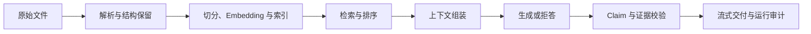

文档成功入库不等于正确证据进入候选集；命中 Gold 文档不等于上下文完整；答案语义相关也不等于每个事实断言都有证据支持。服务接口能够响应，也不意味着真实 RAG 链路具有相同吞吐与延迟。因此，本报告将评测对象定义为 **Evidence Chain + Service Delivery**，同时观察证据质量和系统交付能力，但不把两类指标混算。

本文回答五个研究问题：

- **RQ1：** 冻结语料上的问题构成，能否覆盖事实、多跳、冲突、完整性和拒答等企业 RAG 核心能力？
- **RQ2：** 四个平台在系统接口与服务交付能力评测中的吞吐、响应启动与真实检索链路时延有何差异？
- **RQ3：** 首位命中、高 K 证据覆盖与排序质量是否由同一平台同时领先？
- **RQ4：** 检索质量、答案词面覆盖、语义相关性和证据支持度之间是否一致？
- **RQ5：** MOI 的现有优势和主要损失分别位于证据链的哪个阶段？

## 2. 评测对象

四个平台的产品边界和可观察数据面不同。本文比较的是相同语料、问题与模型条件下的可观测结果，而不是假设其内部实现完全同构。

| 平台 | 服务交付入口 | 检索观测入口 | 本报告中的主要边界 |
|---|---|---|---|
| **MOI** | Catalog A2A `message/stream` | MatrixOne / MOI 原生检索诊断路径 | 可记录原生返回顺序与证据链；受控容量结果包含本地编排链路开销 |
| **Dify** | Workflow streaming | Dataset retrieval | 工作流与知识库凭证分离；服务流式事件与真实检索质量分轨统计 |
| **FastGPT** | OpenAI-compatible chat stream | Collection search | 检索入口可返回原生排序；容量轨与完整 RAG 轨分开执行 |
| **MaxKB** | Application chat stream | Paragraph hit-test | 缺少与其他平台同构的稳定公开排序输出；以管理诊断命中和离线排序作代换 |

`MaxKB*` 表示检索候选来自管理诊断入口，并按 `comprehensive_score` 离线降序恢复排序；原返回顺序保存在本地诊断记录中，不在正文单独展开。

## 3. 实验设计

### 3.1 数据集与能力覆盖

v2.0 使用的混合数据集不是单一公开数据集的直接复跑，而是从 DocBench、EnterpriseRAG-Bench 和 MultiHop-RAG 三类来源收集并筛选文档与问题，统一文档 ID、问题格式、Gold 文档映射和参考答案后合并构建。最终评测包将原始源文件、Ready Markdown、解析树、`corpus.jsonl` 与 Ready-for-eval 结果分层保存，原始语料和评测输入保持物理分离。

| 项目 | 数量或状态 |
|---|---:|
| 文档 | 297 |
| QA | 275 |
| Gold 记录 | 275 |
| 参考答案 | 275 |
| 可回答 QA | 245 |
| 拒答或不可回答 QA | 30 |
| 含 Gold 文档 QA | 265 |
| 空 Gold 的 null / refusal QA | 10 |
| 多文档 QA（Gold 文档数 ≥ 2） | 98 |

构建过程遵循“来源收集与筛选 → 语料规范化 → QA 选择与构造 → Gold 闭包校验 → 纯文本签署”的顺序。题目优先从来源题库中选择；当现有题目不能满足冻结语料、能力覆盖、去重和证据完整性要求时，再基于已收集文档构造问题、参考答案与 Gold。

数据集由 DocBench、EnterpriseRAG-Bench 与 MultiHop-RAG 三类来源构成，分别覆盖长文档理解、企业多源证据和跨文档推理。

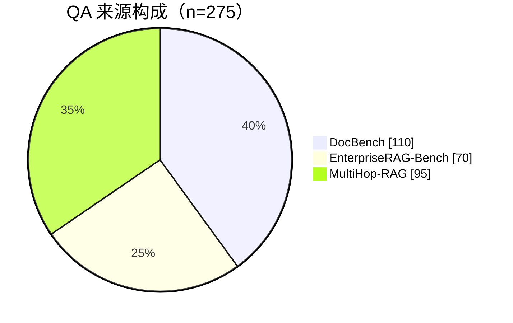

| 来源 | 文档 | QA | QA 占比 | 可回答 | 不可回答 | 主要覆盖 |
|---|---:|---:|---:|---:|---:|---|
| DocBench | 130 | 110 | 40.00% | 93 | 17 | 长文档事实、元数据、结构化抽取、不可回答 |
| EnterpriseRAG-Bench | 47 | 70 | 25.45% | 67 | 3 | 企业多源语义、冲突、约束、完整性、拒答 |
| MultiHop-RAG | 120 | 95 | 34.55% | 85 | 10 | 跨文档比较、推断、时序、null query |

评测入口只消费 297 份 Ready Markdown。语料合计约 **32.78 MiB、34,207,266 个 Unicode 字符**；字符数不等同于模型 Token 数。

| 来源 | 文档 | MiB | 字符数 | 中位字符 | P95 字符 | 最大字符 |
|---|---:|---:|---:|---:|---:|---:|
| DocBench | 130 | 31.15 | 32,504,608 | 54,331 | 1,152,021 | 2,186,837 |
| EnterpriseRAG-Bench | 47 | 0.26 | 275,877 | 5,262 | 12,581 | 14,717 |
| MultiHop-RAG | 120 | 1.38 | 1,426,781 | 8,672 | 23,582 | 70,803 |

问题被归并为七类主能力。QA 与 Multi-hop 是主体，拒答、完整性、冲突、约束和结构化问题共同构成 75 条专项样本。

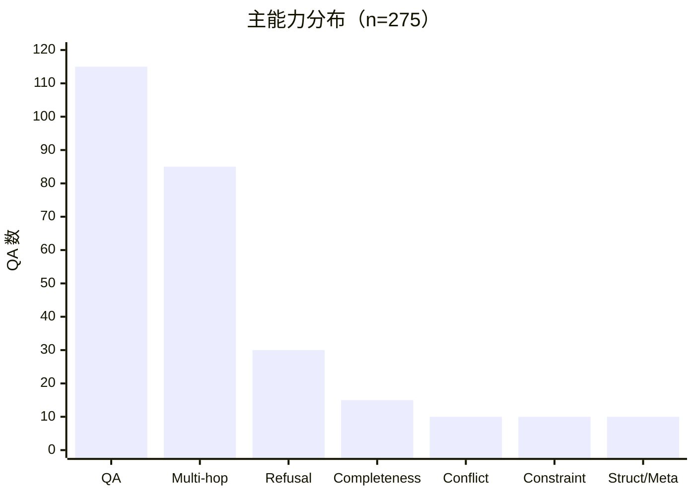

| Question Type | QA | 占比 |
|---|---:|---:|
| text-only | 83 | 30.18% |
| inference_query | 35 | 12.73% |
| comparison_query | 25 | 9.09% |
| temporal_query | 25 | 9.09% |
| basic | 18 | 6.55% |
| unanswerable | 17 | 6.18% |
| completeness | 15 | 5.45% |
| semantic | 10 | 3.64% |
| constrained | 10 | 3.64% |
| conflicting_info | 10 | 3.64% |
| null_query | 10 | 3.64% |
| meta-data | 7 | 2.55% |
| refusal | 3 | 1.09% |
| structured_extraction | 3 | 1.09% |
| intra_document_reasoning | 2 | 0.73% |
| miscellaneous | 2 | 0.73% |

167 条问题只需要一份 Gold 文档，98 条问题需要至少两份文档。10 条 null / refusal 问题保留空 Gold 文档集合，不进入 Retrieval 分母，但进入回答与拒答评测。

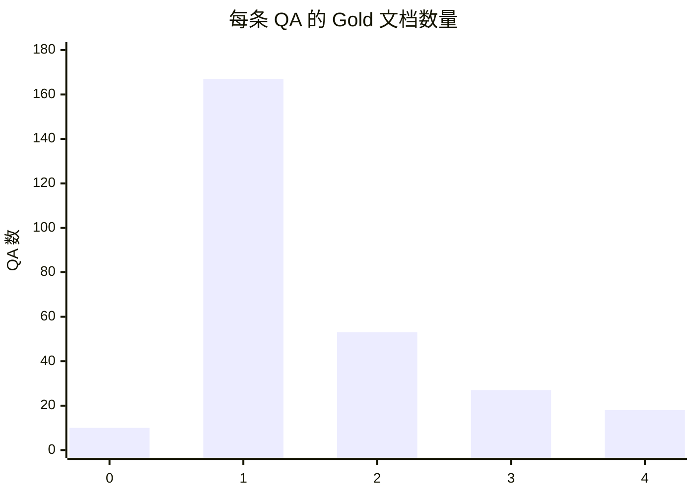

数据质量门槛全部通过：

| 检查 | 结果 | 说明 |
|---|---|---|
| 文档与解析树冻结 | PASS | 297 份文档；`corpus.jsonl` 与解析树逐字节一致 |
| QA / Gold / 参考答案 | PASS | 三者均为 275 条 |
| Gold 文档闭包 | PASS | 所有非空 Gold 文档 ID 均可解析到冻结语料 |
| 问题与 Gold 顺序 | PASS | 逐行 question_id 一致 |
| 归一化问题重复 | PASS | 0 |
| 构造题证据解析 | PASS | 全部构造题证据可解析 |
| 图像或视觉依赖 | PASS | 0 |
| 纯文本评测签署 | PASS | 275 / 275 |

### 3.2 模型与检索配置

- Embedding：MaaS `bge-m3`，1,024 维；文档索引使用该模型生成的冻结结果。
- 生成模型：DeepSeek V4 Flash（DSV4F）。
- Judge：`deepseek-official / deepseek-v4-flash`，`temperature=0`，`max_tokens=2048`，关闭 thinking。
- 四个平台使用相同 Judge Prompt 与响应 Schema；缺失值不插补。
- 当前数据集为纯文本评测集，不调用 MLLM。

### 3.3 v2.0 的双轨评测框架

v2.0 在 RAG 质量评测之外，引入 **系统接口与服务交付能力评测（System Interface & Service Delivery Benchmark）**。该评测轨覆盖接口契约、请求编排、流式响应启动、端到端交付和完整检索链路时延；它与检索、回答和证据质量共同构成 v2.0，但分别统计、分别解释。

| 评测轨 | 负载或分母 | 主要指标 | 解释边界 |
|---|---|---|---|
| 受控流式容量 | 固定 64 个内容 chunk；Connections=1/4/8 | Request QPS、首 SSE Event、E2E、成功率 | 衡量服务编排与流式交付，不代表真实 RAG 或 LLM 速度 |
| 真实检索链路时延 | 同一查询 SHA、10 条 Lenovo 查询 | Retrieval QPS、P50、P95、成功率 | 包含 Query Embedding 与平台编排，不是向量内核耗时 |
| 检索质量 | 265 条具有 Gold 文档的问题 | Recall@1/3/5/10、MRR@10 | MaxKB 使用离线排序代换并以星号标记 |
| 回答与证据质量 | 通用维度 275；回答型证据维度 245；严格拒答 30 | 词面指标、统一 Judge、严格拒答 | 按维度适用样本固定分母；缺失不插补 |

### 3.4 公平性、统计分母与可比性

本研究采用以下规则：

1. **统一冻结优先。** 四平台使用相同语料、问题、Gold、Embedding、生成模型和 Judge 参数。
2. **统计分母预先固定。** Retrieval 使用 265 条具有 Gold 文档的问题；词面指标和通用 Judge 使用全部 275 条问题；Response Claim Correctness、Runtime Context Faithfulness 等回答型指标使用 245 条可回答问题；严格拒答使用 30 条拒答或不可回答问题。
3. **终态账本闭包。** 每个平台的最终评测账本均包含 275 条 Retrieval、275 条 QA 和 275 条 Judge 终态记录。
4. **不可观察能力不反推。** MaxKB 的管理诊断命中与离线分数排序以 `MaxKB*` 标记，不作为严格原生公开排序结果。
5. **缺失与不适用分开。** Judge 无有效结构化输出时记 N/A；结构性不适用样本不进入该维度分母。严格主指标要求覆盖各自全部适用样本，不以已观测均值替代。
6. **指标不跨维度加总。** 服务吞吐、检索召回、词面重合和证据支持度不合成为单一总分。

| 平台 | Retrieval 终态记录 | QA 终态记录 | Judge 终态记录 |
|---|---:|---:|---:|
| MOI | 275 | 275 | 275 |
| Dify | 275 | 275 | 275 |
| FastGPT | 275 | 275 | 275 |
| MaxKB | 275 | 275 | 275 |

## 4. 指标

### 4.1 系统接口与服务交付能力指标

- **Request QPS：** 成功完成的请求数除以测量 Wall Time，不按 SSE Event 数计数。
- **首 SSE Event 延迟：** 从请求开始到首个完整 SSE Frame 被解码的时间。由于历史记录没有保存事件类型，该指标不是 TTFT。
- **E2E 延迟：** 从请求开始到流式响应完成的时间。
- **Retrieval Latency：** 包含 Query Embedding 与平台编排的完整检索契约时延，不等同于向量数据库内核延迟。
- **成功率：** 在给定超时与并发条件下成功完成的请求比例。

### 4.2 检索指标

对问题 q，设 Gold 文档集合为 $G_q$，系统 Top-K 返回为 $R_q@K$：

$$
Recall@K(q)=\frac{|R_q@K\cap G_q|}{|G_q|}
$$

$$
MRR@10=\frac{1}{|Q|}\sum_{q\in Q}\frac{1}{rank_q}
$$

Top-10 没有相关文档时，该问题的倒数排名记 0。Recall 与 MRR 在 265 条具有 Gold 文档的问题上取宏平均；10 条空 Gold 问题不进入检索分母。

### 4.3 回答与证据指标

- **Token F1、Exact Match、Contains Gold：** 衡量预测答案与参考答案的词面重合，分母均为 275。
- **Answer Relevance：** 回答是否直接回应问题。
- **No Contradiction：** 回答是否与参考答案或已知事实冲突。
- **Instruction Following：** 是否遵守问题中的范围、格式或拒答要求。
- **Response Claim Correctness：** 系统实际输出的事实断言是否正确；仅在 245 条可回答问题上聚合。
- **Runtime Context Faithfulness：** 回答是否得到实际检索上下文支持；仅在 245 条可回答问题上聚合。若显式运行上下文存在但不支持答案，记 0，而不是 N/A。
- **Unsupported Claim Rate：** 回答中未被参考证据支持的断言比例，越低越好。
- **Strict Unanswerable Success：** 对 30 条拒答或不可回答问题，是否正确拒答且不产生无依据事实。

统一 Judge 的固定参数为：

- Provider：`deepseek-official`
- Model：`deepseek-v4-flash`
- Temperature：0
- Max tokens：2048
- Thinking：disabled
- Prompt hash：`sha256:d9059c00787767d0b24fe20bbea80748f12a9c59d2fb7d23f1ed75263fbc26be`
- Response schema hash：`sha256:ee521409b5d5da7d39d672e4196fd1128179367e27732e5fa79dcb8018844bd8`

## 5. 实验结果

### 5.1 系统接口与服务交付能力：受控容量与真实检索时延应分开解释

受控容量轨为每个请求固定输出 64 个内容 chunk、间隔 10 ms，理论流式主体下限约 640 ms；Connections 取 1、4、8，预热 10 秒、计时 60 秒、超时 30 秒，每档 3 轮取中位数，平台严格串行。

Connections=8 时，FastGPT 达到 **9.926 Request QPS**，MaxKB 为 **8.616**；Dify 和 MOI 分别为 **0.450** 和 **0.364**。全部 12 个“平台 × Connections”组合中，Little 定律推算 QPS 与实测值的最大相对偏差为 **1.26%**，表明结果没有将 SSE Event 误算为独立请求。

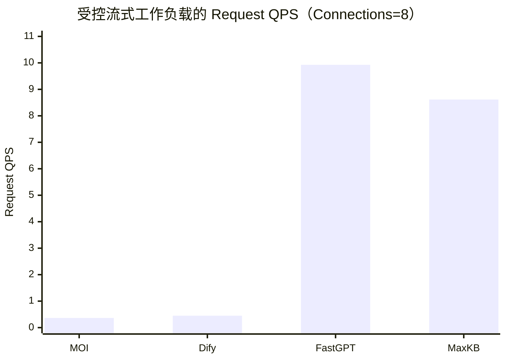

| 平台 | Request QPS | 首 SSE Event P95 | E2E 平均 | 平均在途请求 | Little 定律 QPS | 成功率 |
|---|---:|---:|---:|---:|---:|---:|
| MOI | 0.364 | 3,177.837 ms | 21,638.417 ms | 7.848 | 0.363 | 100% |
| Dify | 0.450 | 21,255.682 ms | 16,149.317 ms | 7.256 | 0.449 | 100% |
| FastGPT | 9.926 | 130.280 ms | 801.224 ms | 7.954 | 9.927 | 100% |
| MaxKB | 8.616 | 578.309 ms | 927.673 ms | 7.988 | 8.611 | 100% |

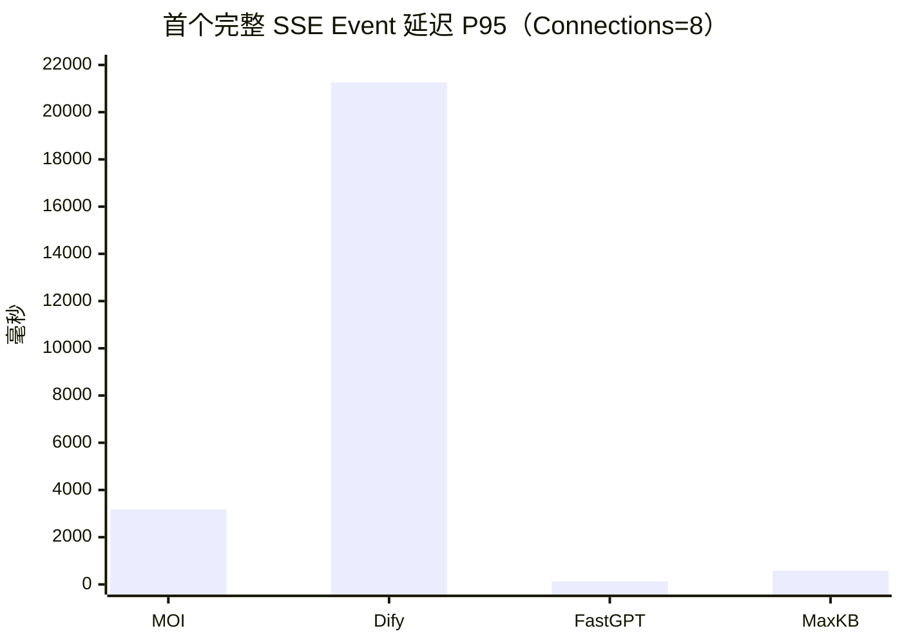

首 SSE Event 可能是生命周期或控制事件，只能用于观察响应启动、缓冲和协议转发，不能解释为首个答案 Token。Dify 在 C8 下该指标达到 21.3 秒，提示并发时存在排队或工作流阻塞现象；没有内部 Trace 时，本报告不进一步归因。

在同一查询 SHA、`seed=20260826` 的 Lenovo 10-query 检索轨中，四个平台均为 10/10 成功。FastGPT P50 最低，为 **443.851 ms**；MOI、Dify、MaxKB 分别为 **981.858、1,369.693、2,098.449 ms**。

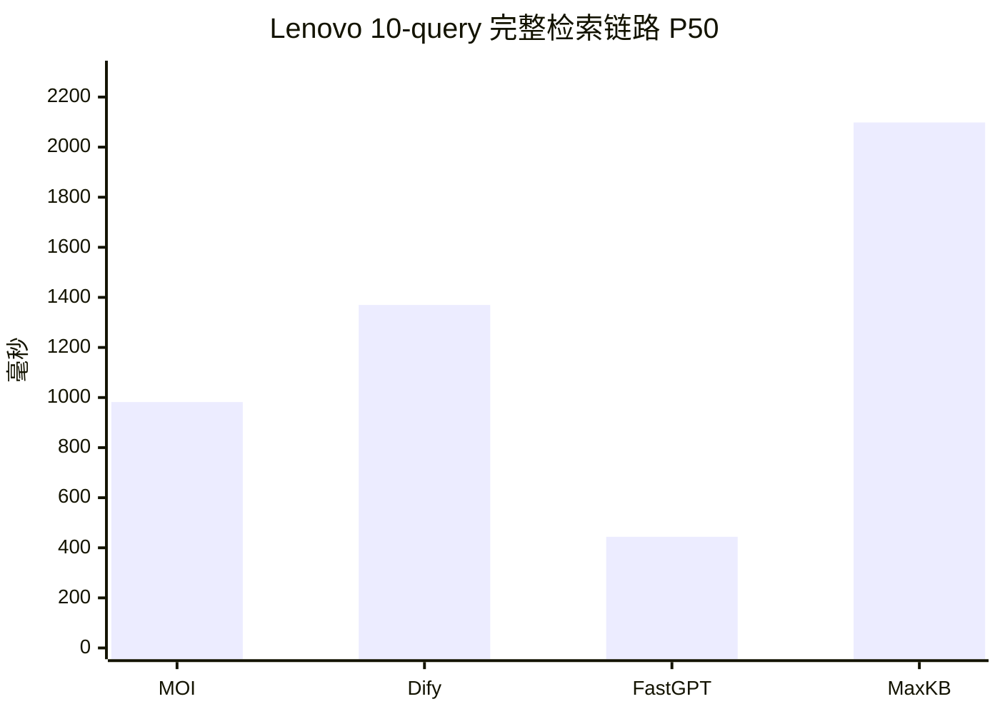

| 平台 | 成功 | Retrieval QPS | P50 | P95 | 实际并发 |
|---|---:|---:|---:|---:|---:|
| MOI | 10/10 | 0.314 | 981.858 ms | 2,882.385 ms | 1 |
| Dify | 10/10 | 2.030 | 1,369.693 ms | 3,057.914 ms | 4 |
| FastGPT | 10/10 | 8.415 | 443.851 ms | 547.966 ms | 4 |
| MaxKB | 10/10 | 1.465 | 2,098.449 ms | 3,296.306 ms | 4 |

该计时包含 Query Embedding 与平台编排；MOI 实际并发为 1，其他平台为 4，因此 Retrieval QPS 不是严格同条件排名。最小服务链路没有完成四平台正式串行轮次，本报告不发布不完整结果。

### 5.2 检索：首位命中与高 K 覆盖由不同平台领先

在 265 条有 Gold 文档的问题上，MOI 的 Recall@1 为 **59.50%**，高于 Dify **54.34%** 和 FastGPT **56.07%**；但 MOI 到 Recall@10 仅提升至 **61.95%**。FastGPT Recall@10 达到 **85.66%**，Dify 为 **83.33%**，表明两者扩大 Top-K 后能够找回更多完整证据。

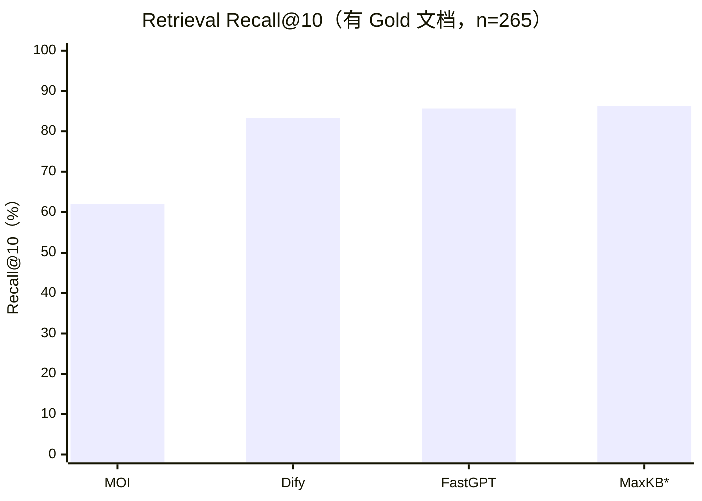

| 平台 | Recall@1 | Recall@3 | Recall@5 | Recall@10 | MRR@10 | 排序与可比性 |
|---|---:|---:|---:|---:|---:|---|
| MOI | **59.50%** | 60.06% | 60.06% | 61.95% | 77.80% | 统一层原生返回顺序 |
| Dify | 54.34% | 70.00% | 76.86% | 83.33% | 77.44% | 统一层原生返回顺序 |
| FastGPT | 56.07% | 72.33% | 77.67% | **85.66%** | **78.13%** | 统一层原生返回顺序 |
| MaxKB* | 55.06% | 73.08% | 79.91% | 86.23% | 77.54% | 诊断命中 + 离线分数降序 |

> **注：** MaxKB* 的检索候选来自管理诊断入口，并按 `comprehensive_score` 离线降序；其指标属于诊断代换，不能视为与其他平台同等级的原生排序结果。

MOI 的相关结果更集中在首位，Recall@K 却几乎不随 K 增长。这通常指向候选集覆盖、文档去重或返回数量限制，而不是首位排序能力不足；仍需结合逐题候选数和缺失 Gold 切片验证。

### 5.3 回答词面指标：MOI Token F1 最高

MOI 的 Token F1 为 **30.05%**，MaxKB* 为 **29.00%**，Dify 为 **24.12%**，FastGPT 为 **19.49%**。四个平台 Exact Match 均低于 1.1%，说明开放式回答具有显著措辞差异；词面指标适合描述答案重合度，不替代语义正确性。

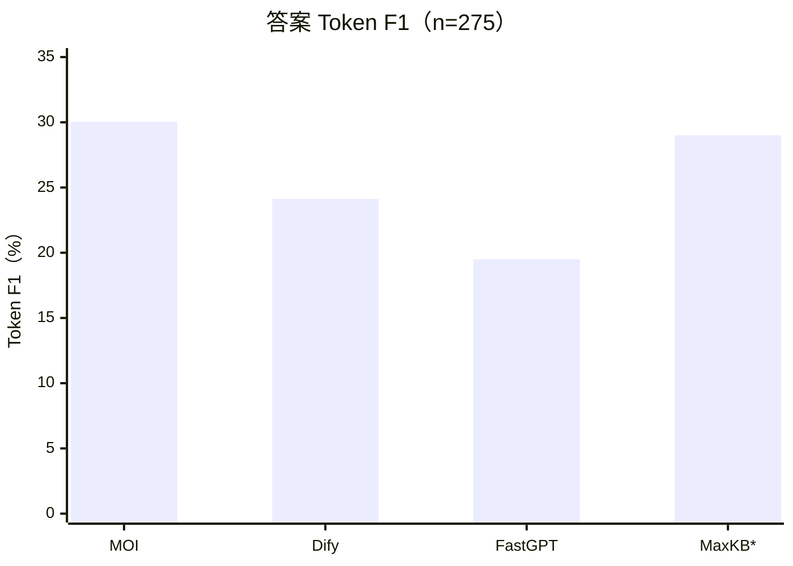

| 平台 | Token F1 | Exact Match | Contains Gold |
|---|---:|---:|---:|
| MOI | **30.05%** | 0.36% | 24.73% |
| Dify | 24.12% | 0.36% | 24.36% |
| FastGPT | 19.49% | 0.00% | 13.45% |
| MaxKB* | 29.00% | **1.09%** | **26.91%** |

FastGPT 的严格原生 Recall@10 最高，但答案词面指标最低，说明瓶颈可能发生在上下文筛选、组装、提示模板或生成阶段，而不只是“是否检索到 Gold 文档”。

### 5.4 统一 Judge：相关性与证据约束必须同时解释

统一 Judge 的答案相关性为 MaxKB* **69.31%**、MOI **68.47%**、FastGPT **57.09%**、Dify **55.49%**。MaxKB* 的无矛盾率也最高，为 **92.84%**。在 245 条可回答问题上，Response Claim Correctness 依次为 MaxKB* **65.80%**、MOI **61.02%**、FastGPT **50.98%**、Dify **47.02%**；Runtime Context Faithfulness 依次为 MaxKB* **66.73%**、MOI **62.72%**、FastGPT **51.39%**、Dify **50.80%**。

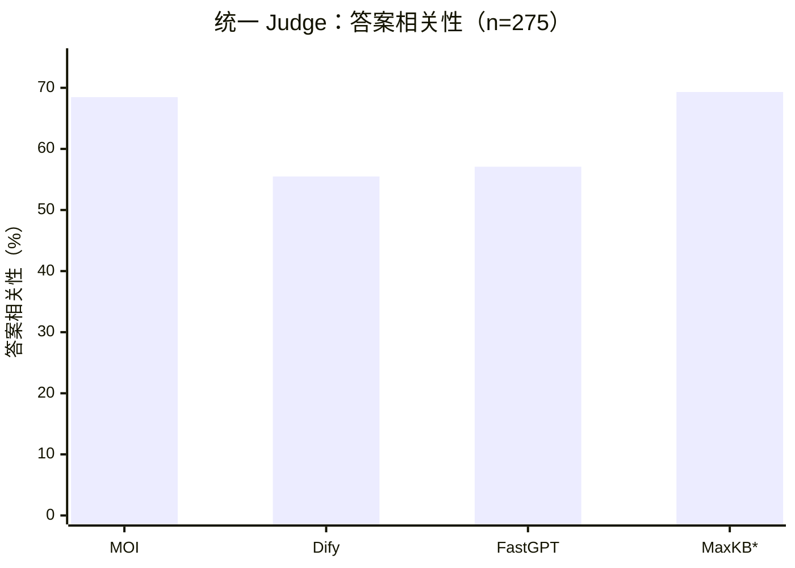

答案相关不等于证据充分。Unsupported Claim Rate 越低越好，Dify 为 **60.64%**，FastGPT 为 **61.09%**，MOI 为 **64.97%**，MaxKB* 为 **72.47%**。四个平台都存在明显的参考证据不支持断言问题。

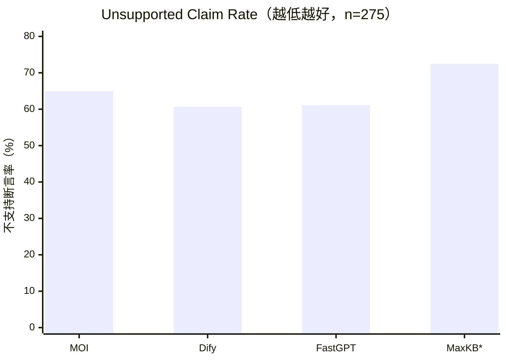

| 平台 | 答案相关性 | 无矛盾 | 指令遵循 | Response Claim Correctness | Runtime Context Faithfulness | Unsupported Claim Rate | 严格拒答成功 |
|---|---:|---:|---:|---:|---:|---:|---:|
| MOI | 68.47% | 86.91% | **74.18%** | 61.02% | 62.72% | 64.97% | 73.33% |
| Dify | 55.49% | 87.13% | 58.91% | 47.02% | 50.80% | **60.64%** | 83.33% |
| FastGPT | 57.09% | 80.36% | 58.73% | 50.98% | 51.39% | 61.09% | 86.67% |
| MaxKB* | **69.31%** | **92.84%** | 71.64% | **65.80%** | **66.73%** | 72.47% | **90.00%** |

2026-08-28 按完全相同的 Judge 模型、Prompt / Schema 哈希、temperature 和 thinking 配置定向重试缺失项。重试后进行协议审计发现，MaxKB 剩余 5 条 Response Claim Correctness 与 2 条 Runtime Context Faithfulness 均属于不可回答问题，对回答型指标是结构性不适用，不应阻断 245 条可回答问题的聚合。MOI 剩余 1 条为可回答问题，运行账本中存在显式检索上下文，但命中了与问题无关的文档；依据 Runtime Context Faithfulness 定义，该样本可直接判定为 0，而不是 N/A。

重新聚合后，四个平台的通用 Judge 维度均覆盖 **275/275**，回答型 Judge 维度均覆盖 **245/245**，严格拒答均覆盖 **30/30**，本表不再存在实验性缺失值。上述处理是按预先定义的适用域排除结构性不适用样本，并对“上下文存在但不支持答案”的样本计 0；不是均值插补。

## 6. 跨维度综合分析

### 6.1 条件化结果摘要

| 能力面 | 当前记录中的突出者 | MOI 的相对位置 | 解释边界 |
|---|---|---|---|
| 受控流式吞吐 | FastGPT、MaxKB | 当前记录较低 | 合成流式负载，不含真实检索和 LLM |
| 真实检索链路 P50 | FastGPT | 第二低 | 仅 10 条；MOI 实际并发为 1 |
| 严格原生 Recall@10 | FastGPT | 高 K 覆盖不足 | MaxKB* 不进入严格原生排名 |
| Recall@1 | MOI | 四平台最高 | Recall@K 增长有限 |
| MaxKB 诊断 Recall@10 | MaxKB* | N/A | 依赖管理诊断入口和离线排序 |
| Token F1 | MOI | 四平台最高 | 仅衡量词面重合 |
| Judge 答案相关性 | MaxKB*、MOI | 第二高 | 回答型 Judge 指标已按 245 条适用分母闭包 |
| Unsupported Claim Rate | Dify | 绝对值仍偏高 | 四平台均超过 60% |
| 严格拒答成功率 | MaxKB* | 73.33% | 分母仅 30 条 |

### 6.2 没有跨维度的全局冠军

- FastGPT 在受控流式吞吐、真实检索链路时延和严格原生 Recall@10 上表现突出，但答案词面指标与 Judge 结果没有同步领先。
- MaxKB 的受控吞吐较高，离线排序后的候选覆盖和答案相关性也较高，但检索排序属于代换口径，Unsupported Claim Rate 为四平台最高。
- Dify 的高 K 检索覆盖较强，Unsupported Claim Rate 相对最低，但答案相关性和词面分数较低。
- MOI 的 Recall@1、Token F1 和答案相关性具有竞争力，但高 K 覆盖、服务吞吐和证据约束仍有明显改进空间。

这说明平台差异不是一条从弱到强的直线，而是服务交付、候选覆盖、排序、上下文组织、答案生成和证据约束之间的多维权衡。

### 6.3 研究问题回答

| 研究问题 | 基于当前证据的回答 |
|---|---|
| **RQ1：问题构成是否覆盖核心能力？** | 基本覆盖。275 条问题包含 98 条多文档、30 条拒答或不可回答，以及冲突、完整性、约束和结构化专项样本；但各专项切片仍偏小。 |
| **RQ2：系统接口与服务交付能力如何？** | FastGPT 与 MaxKB 在受控流式负载下吞吐更高，FastGPT 的 10-query 完整检索链路 P50 最低；两条轨的负载和并发不同，不能互相替代。 |
| **RQ3：首位命中与高 K 覆盖是否一致？** | 不一致。MOI Recall@1 最高，FastGPT 严格原生 Recall@10 最高；MaxKB* 的离线排序进一步说明候选集合与返回次序是两个问题。 |
| **RQ4：检索、答案和证据指标是否一致？** | 不一致。FastGPT 的检索领先没有转化为最高 Token F1；MaxKB* 的答案相关性最高，但 Unsupported Claim Rate 也最高。 |
| **RQ5：MOI 的优势和损失在哪里？** | 优势集中在首位命中、词面覆盖和答案相关性；主要损失位于高 K 候选扩展、流式服务交付与不支持断言控制。 |

## 7. MOI 的证据链诊断

### 7.1 已被当前数据支持的优势

1. **首位检索具有竞争力。** MOI Recall@1 为 59.50%，在四平台主表中最高；MRR@10 为 77.80%，与最高值接近。
2. **答案词面覆盖领先。** Token F1 为 30.05%，高于 Dify、FastGPT 和 MaxKB*。
3. **回答与问题的语义相关性较高。** Answer Relevance 为 68.47%，仅略低于 MaxKB*。
4. **证据链可进行逐阶段诊断。** 本地账本保留 Retrieval、QA、Judge 和运行血缘，可将候选缺失、排序损失、上下文利用与 Judge 协议归一化分开分析。

### 7.2 当前最明显的缺口

1. **Top-K 扩展收益不足。** Recall@1 到 Recall@10 只增加 2.45 个百分点，远低于 Dify 和 FastGPT 的增幅。
2. **受控服务负载下吞吐偏低。** C8 Request QPS 为 0.364，E2E 平均 21.64 秒；需要拆分服务编排、队列、连接和流式转发耗时。
3. **不支持断言比例较高。** Unsupported Claim Rate 为 64.97%，说明答案相关性尚未转化为充分的证据约束。
4. **运行上下文利用仍有明显缺口。** Runtime Context Faithfulness 为 62.72%；其中一条可回答样本检索到无关文档，按协议计 0，直接暴露了检索—生成证据链断裂。
5. **外部可比性依赖数据包正式发布。** v2.0 使用收集并合并构建的混合数据集，当前适合四平台同条件横向比较；在数据许可、来源清单和冻结哈希完整发布前，不应与未使用该数据集的外部结果直接排名。

### 7.3 优先优化假设

- 对 MOI 逐题统计候选池规模、去重前后数量、实际返回条数与缺失 Gold 类型，确认 Recall@K 平台期的根因。
- 将服务耗时拆分为鉴权、工作流调度、Query Embedding、检索、模型请求、首答案事件与流结束，避免以首 SSE Event 代替 TTFT。
- 对高 Unsupported Claim 样本检查检索证据是否进入上下文、提示是否强制引用、拒答阈值是否合理。
- 在同一冻结集上做 `vector only / full-text only / hybrid` 与候选扩展消融，先定位收益，再考虑引入额外重排组件。
- 将 Judge 的结构化 Claim 提取、维度适用域与 Runtime Trace 定义固化到协议，避免结构性不适用样本被误记为实验缺失。

## 8. 效度边界与场景化含义

### 8.1 局限性与稳健性

1. **混合数据集尚缺公开外部基线。** v2.0 的主要价值是四平台在同一收集、筛选和合并数据集上的横向比较；其跨研究复现能力取决于后续的数据许可、来源清单、冻结哈希和正式发布包。
2. **MaxKB 检索不是严格原生可比。** 主诊断指标依赖管理入口和离线分数排序，正文以星号标记，原返回顺序保留在本地审计记录中。
3. **受控流式容量不代表真实 RAG。** 该轨只覆盖请求路由、工作流调度、模型适配和 SSE 转发。
4. **首 SSE Event 不是 TTFT。** 现有记录没有保存事件类型，不能判断首事件是否包含答案 Token。
5. **真实检索时延样本较小且并发不完全一致。** 只有 10 条查询，MOI 实际并发为 1，其他平台为 4。
6. **生成与 Judge 属于同一模型家族。** 统一 Judge 保证横向参数一致，但可能存在模型家族自评偏差。
7. **Judge 指标适用分母不同。** 通用维度使用 275 条，回答型证据维度使用 245 条，严格拒答使用 30 条；这些指标不能假设共享同一分母。定向重试后的残余项已按协议归类，适用样本均完整覆盖且未进行均值插补。
8. **词面指标对开放式回答偏严格。** Exact Match 极低不等于回答完全错误，必须与 Judge、拒答和证据指标联合解释。

稳健性检查包括：四平台 275 条评测账本闭包；统一 Judge 参数及 Prompt / Schema 哈希；MaxKB 离线排序方法和原顺序审计记录均已保存；受控容量通过 Little 定律交叉验证；数据集质量门槛全部通过。

### 8.2 场景化选型含义

1. **高并发服务交付：** 当前记录支持优先验证 FastGPT 与 MaxKB，但上线前仍需用真实检索和真实模型负载复测。
2. **强调首条命中与答案词面覆盖：** MOI 值得进一步 POC，同时必须检查高 K 证据遗漏和引用约束。
3. **强调广召回：** FastGPT 的严格原生 Recall@10 更有优势；Dify 也表现出较强的 Top-K 扩展能力。
4. **使用 MaxKB：** 应确认生产链路实际采用的排序字段和方向，不应直接把管理入口原返回次序视为相关性排名。
5. **高风险或合规问答：** 不应只看答案相关性；至少同时设置 Unsupported Claim、Runtime Context Faithfulness、严格拒答和可核验引用门槛。

## 9. 结论与后续工作

MOI RAG Benchmark Report v2.0 与 v1.0 构成两条并行研究线：v1.0 主要回答平台在公开数据集上的 Benchmark 表现，v2.0 则回答平台在独立收集、筛选和合并构建的数据集上，如何同时完成 RAG 证据链与系统接口交付。v2.0 的核心结论不是“四个平台谁第一”，而是不同平台在证据链和服务交付链上的损失位置不同。FastGPT 在当前严格原生高 K 检索与服务时延上表现突出；MaxKB 展现出较强候选覆盖，但排序解释依赖离线代换；Dify 的不支持断言比例相对最低；MOI 在首位命中、Token F1 和答案相关性上具有竞争力，但高 K 召回、流式吞吐和证据约束仍是主要短板。

下一轮工作按以下优先级推进：

1. 完成 v2.0 数据集的 Dataset Card、来源与许可清单、冻结哈希和正式发布包，并在同一冻结快照下固化四平台 Run Manifest。
2. 记录首个生命周期事件、首个答案事件和首个文本 Token，建立真正的 TTFT 指标。
3. 统一四平台实际并发并扩大真实检索查询规模，同时拆分 Embedding、平台编排与向量检索耗时。
4. 为 MaxKB 建立可复现的原生排序输出；实现前在正文保持星号标记，并保留原顺序审计记录。
5. 对 MOI 的候选池与 Top-K 平台期、FastGPT 的检索—生成落差，以及四平台高 Unsupported Claim 样本分别开展逐题诊断。
6. 使用独立模型家族复核 Judge 稳健性，并将 Claim、Runtime Trace 与引用定位器定义固化为下一版协议。

可信 RAG Benchmark 最终应连续回答七个问题：**语料是否可控、证据是否存活、候选是否找全、排序是否可靠、上下文是否干净、答案是否正确完整、系统是否能够稳定交付并留下可审计记录。**

<!--
Source inventory (kept out of the rendered narrative):
- Dataset construction summary: datasets/moi-rag-bench-v0.3.1-qa-revision/qa-revision-summary.json
- Dataset validation: datasets/moi-rag-bench-v0.3.1-qa-revision/validation.json
- Ready package: datasets/moi-rag-bench-v0.3.1-qa-revision/ready_for_eval
- Service capability artifact: runs/api-test-final-20260826-v2/artifact.json
- Service capability rendered source: runs/api-test-final-20260826-v2/report.html
- Four-platform campaign: runs/bench-v0.3.1-merged/campaign-summary.json
- Four-platform merged runs: runs/bench-v0.3.1-merged/20260827-*-v031-merged-275
- Judge applicability reaggregation: runs/bench-v0.3.1-merged/recovery/judge-applicability-reaggregation-20260828/manifest.json
- MaxKB offline ordering method: scripts/tools/build_moi_rag_benchmark_report_v2.py::maxkb_retrieval_diagnostics

Chart map:
- Dataset source composition: composition / pie; fields source, questions.
- Capability distribution: comparison / bar; fields capability, count.
- Gold cardinality: distribution / bar; fields gold_document_count, question_count.
- Controlled C8 QPS: comparison / bar; fields platform, request_qps.
- First SSE event P95: comparison / bar; fields platform, first_sse_event_p95_ms.
- Lenovo retrieval P50: comparison / bar; fields platform, retrieval_p50_ms.
- Retrieval Recall@10: comparison / bar; fields platform, recall_at_10.
- Token F1: comparison / bar; fields platform, token_f1.
- Judge answer relevance: comparison / bar; fields platform, answer_relevance.
- Unsupported Claim Rate: comparison / bar; fields platform, unsupported_claim_rate.
-->
